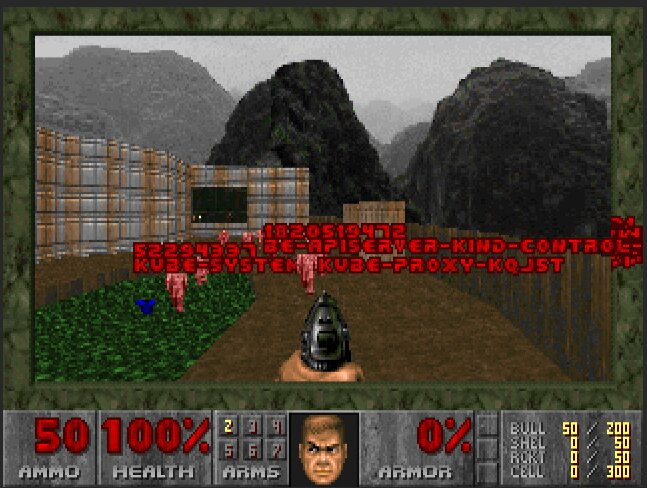

# Kube DOOM
## Kill Kubernetes pods using Id's Doom!

The next level of chaos engineering is here! Kill pods inside your Kubernetes
cluster by shooting them in Doom!

This is a fork of the excellent
[gideonred/dockerdoomd](https://github.com/gideonred/dockerdoomd) using a
slightly modified Doom, forked from https://github.com/gideonred/dockerdoom,
which was forked from psdoom.



## Running Locally

In order to run locally you will need to

1. Run the kubedoom container
2. Attach a VNC client to the appropriate port (5901)

### With Docker

Run `ghcr.io/storax/kubedoom:latest` with docker locally:

```console
$ docker run -p5901:5900 \
  --net=host \
  -v ~/.kube:/root/.kube \
  --rm -it --name kubedoom \
  ghcr.io/storax/kubedoom:latest
```

Optionally, if you set `-e NAMESPACE={your namespace}` you can limit Kubedoom to deleting pods in a single namespace

### With Podman

Run `ghcr.io/storax/kubedoom:latest` with podman locally:

```console
$ podman run -it -p5901:5900/tcp \
  -v ~/.kube:/tmp/.kube --security-opt label=disable \
  --env "KUBECONFIG=/tmp/.kube/config" --name kubedoom
  ghcr.io/storax/kubedoom:latest
```

### Attaching a VNC Client

Now start a VNC viewer and connect to `localhost:5901`. The password is `idbehold`:
```console
$ vncviewer viewer localhost:5901
```
You should now see DOOM! Now if you want to get the job done quickly enter the
cheat `idspispopd` and walk through the wall on your right. You should be
greeted by your pods as little pink monsters. Press `CTRL` to fire. If the
pistol is not your thing, cheat with `idkfa` and press `5` for a nice surprise.
Pause the game with `ESC`.

### Killing namespaces

Kubedoom now also supports killing namespaces [in case you have too many of
them](https://github.com/storax/kubedoom/issues/5). Simply set the `-mode` flag
to `namespaces`:

```console
$ docker run -p5901:5900 \
  --net=host \
  -v ~/.kube:/root/.kube \
  --rm -it --name kubedoom \
  ghcr.io/storax/kubedoom:latest \
  -mode namespaces
```

### Running Kubedoom inside Kubernetes

See the example in the `/manifest` directory. You can quickly test it using
[kind](https://github.com/kubernetes-sigs/kind). Create a cluster with the
example config from this repository:

```console
$ kind create cluster --config kind-config.yaml
Creating cluster "kind" ...
 ✓ Ensuring node image (kindest/node:v1.23.0) 🖼
 ✓ Preparing nodes 📦 📦
 ✓ Writing configuration 📜
 ✓ Starting control-plane 🕹️
 ✓ Installing CNI 🔌
 ✓ Installing StorageClass 💾
 ✓ Joining worker nodes 🚜
Set kubectl context to "kind-kind"
You can now use your cluster with:

kubectl cluster-info --context kind-kind

Not sure what to do next? 😅  Check out https://kind.sigs.k8s.io/docs/user/quick-start/
```

This will spin up a 2 node cluster inside docker, with port 5900 exposed from
the worker node. Then run kubedoom inside the cluster by applying the manifest
provided in this repository:

```console
$ kubectl apply -k manifest/
namespace/kubedoom created
deployment.apps/kubedoom created
serviceaccount/kubedoom created
clusterrolebinding.rbac.authorization.k8s.io/kubedoom created
```

To connect run:
```console
$ vncviewer viewer localhost:5900
```

Kubedoom requires a service account with permissions to list all pods and delete
them and uses kubectl 1.23.2.

## Building Kubedoom

The repository contains a Dockerfile to build the kubedoom image. You have to
specify your systems architecture as the `TARGETARCH` build argument. For
example `amd64` or `arm64`.

```console
$ docker build --build-arg=TARGETARCH=amd64 -t kubedoom .
```

To change the default VNC password, use `--build-arg=VNCPASSWORD=differentpw`.
